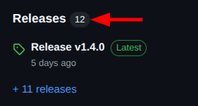
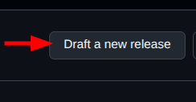
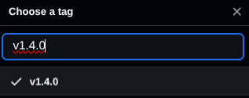

# Open Proces Huis (frontend)

This repo holds the [Ember](https://emberjs.com/) project that serves as the frontend of Open Proces Huis. Open Proces Huis is one of many applications developed under the [Agentschap Binnenlands Bestuur (ABB)](https://www.vlaanderen.be/agentschap-binnenlands-bestuur), which is part of the [Flemish Government](https://www.vlaanderen.be/en). It allows for _lokale besturen_ to create and share processes. Such process is created by uploading a BPMN file, and can be populated further with other types of files that serve as attachments. The application also allows for uploading new versions of a process's BPMN file, enabling for a very rudamentary idea of version control.

## Getting started

### Backend

The frontend relies on some backend for proper running. In fact, it relies on a wide range of microservices, each doing its own part. The setup of the complete microservices stack can be found in [this repo](https://github.com/lblod/app-openproceshuis), whose README also stipulates the necessary steps to undertake in order to get the stack running.

### Frontend

> First make sure the backend is up and running.

1. Clone this repository

```bash
git clone https://github.com/lblod/frontend-openproceshuis.git
```

2. Download the necessary NPM packages

```bash
cd /path/to/project
```

```bash
npm install
```

3. Run the project

```bash
ember serve --proxy "http://localhost:80"
```

4. In your browser, go to [localhost:4200](http://localhost:4200) to visit the homepage of the web application.

## Routes

As with any Ember project, [router.js](./app/router.js) holds all possible routes the application offers. What follows, is a brief overview of the most important ones.

- `/mock-login`: log in using a mock user (every user is part of a _lokaal bestuur_)
- `/processen`: list all processes of all _lokale besturen_
- `/processen/<id>`: consult the details, the latest BPMN file, all BPMN file versions, and attachments of a specific process
- `/gedeelde-processen`: list all processes of the current user's _lokaal bestuur_ and upload a new one (a BPMN file is always the starting point for the creation of a process)

## How to make a release

Before you make a release. Here is a checklist to make sure you have everything ready before releasing. In this example we will simulate bumping from version `1.3.0` to `1.4.0`

### 1. Update the changelog

- Go to the `CHANGELOG.md` and update according to the merged PR's since the latest release.
- Group into sections. Currently we use:
  - :rocket: Enhancement (new features)
  - :bug: Bugfixes
  - :wrench: Maintenance
- Format using the same style as previous entries (PR number, description, author mention).
- Sort by PR number in descending order

### 2. Bump the version

- Go to the `package.json` and change the version like this:

```diff
-   "version": "1.3.0",
+   "version": "1.4.0",
```

- Commit and push:

```sh
git add CHANGELOG.md package.json
git commit -m "Release v1.4.0"
git push
```

### 3. Tag the release

```sh
git tag -a v1.4.0 -m "Release v1.4.0"
git push origin v1.4.0
```

You could also do this in the Github UI.

### 4. Merge previous tag to current tag

Go to the Github UI and go to the releases page



Draft a new release



Choose the tag that you created



- Select the new tag in the first dropdown
- Set `master` as the target branch
- Set the previous tag
- Set the release title (eg. Release 1.4.0)
- Add the release notes in the description. As we currently are keeping track of the changes in our `CHANGELOG.md`, we can just copy and paste the changelog of the new version we previously created.
- Check set as latest release and click on `Publish release`
